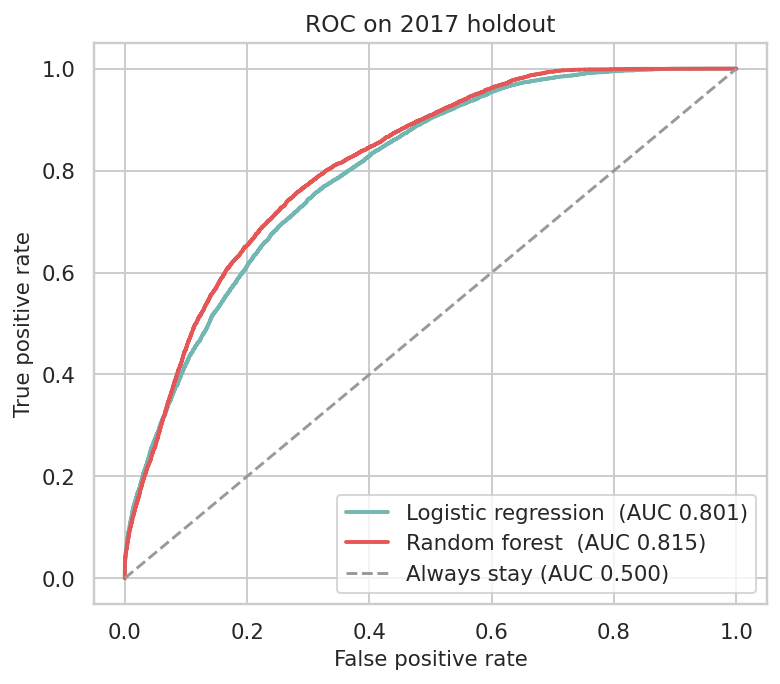
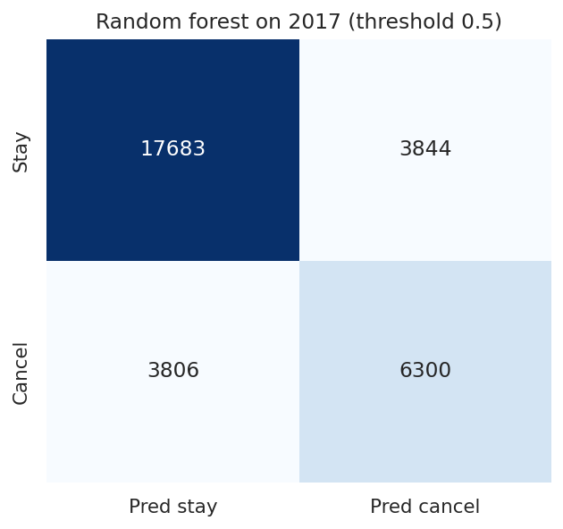
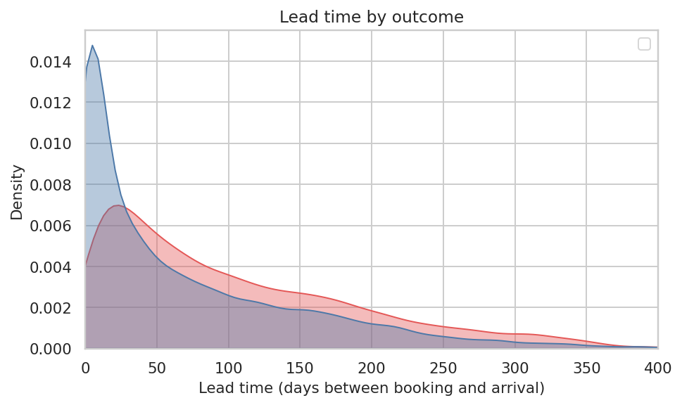

<h1>Hotel Booking Cancellation Prediction</h1>

  
  
  
  
  
  

<blockquote><em>End-to-end binary classification on hotel booking data — can we predict at booking time whether a guest will cancel?</em></blockquote>

<h2>The question</h2>

Can you tell, from the booking itself, whether a guest is going to cancel?

This is a classification project on hotel reservations from two hotels in Portugal (one city hotel, one resort). Arrivals run from July 2015 to August 2017. The public dataset is from Antonio, Almeida &amp; Nunes, <a href="https://www.nature.com/articles/s41597-019-0075-9"><em>Scientific Data</em>, 2019</a>.

People search for this as "hotel churn". It is booking cancellations, not subscription churn. Same question though: <strong>is this reservation shaky?</strong>

The walkthrough lives in <a href="notebooks/hotel_cancellation.ipynb"><code>notebooks/hotel_cancellation.ipynb</code></a>.

<h2>The number I care about</h2>

On 2017 arrivals (held out), a <strong>random forest</strong> gets <strong>ROC-AUC 0.815</strong>.

Accuracy is 75.8%. That sounds fine until you notice that always predicting "they will stay" already scores <strong>68.1%</strong> on this test year. So I also report precision, recall, F1, and AUC.

I trained logistic regression too (AUC <strong>0.801</strong>). It is a bit worse at ranking, better at catching cancels (recall 0.75 vs 0.62), and easier to read. I kept it as a baseline and used the forest as the main model.

<h2>Data</h2>

<table>
  <thead>
    <tr><th></th><th></th></tr>
  </thead>
  <tbody>
    <tr><td>File</td><td><a href="data/hotel_bookings.csv"><code>data/hotel_bookings.csv</code></a></td></tr>
    <tr><td>Raw rows</td><td>119,390</td></tr>
    <tr><td>After dropping 31,994 exact duplicates and 166 zero-guest bookings</td><td><strong>87,230</strong></td></tr>
    <tr><td>Canceled (cleaned)</td><td>24,009 (<strong>27.5%</strong>)</td></tr>
    <tr><td>Hotels</td><td>City 53,274 · Resort 33,956</td></tr>
    <tr><td>Label</td><td><code>is_canceled</code> (1 = canceled or no-show)</td></tr>
  </tbody>
</table>

I do <strong>not</strong> use <code>reservation_status</code> or <code>reservation_status_date</code>. Those columns are the outcome written down after the fact (<code>Check-Out</code> = stayed, <code>Canceled</code> / <code>No-Show</code> = canceled). Putting them in the model would be cheating.

<code>assigned_room_type</code> is dropped as well. The hotel often only knows the assigned room at check-in.

<h2>Split</h2>

Cancel rates climb over the three years after cleaning (20.3% → 26.5% → 31.9%), and the calendar is uneven: 2015 starts in July, 2017 ends in August. A shuffled split would mix 2017 into training.

<ul>
  <li><strong>Train:</strong> arrivals in 2015–2016 · 55,597 rows · 25.0% canceled</li>
  <li><strong>Test:</strong> arrivals in 2017 · 31,633 rows · 31.9% canceled</li>
</ul>

<h2>Results (2017 holdout)</h2>

<table>
  <thead>
    <tr>
      <th>Model</th>
      <th>Accuracy</th>
      <th>Precision</th>
      <th>Recall</th>
      <th>F1</th>
      <th>ROC-AUC</th>
    </tr>
  </thead>
  <tbody>
    <tr>
      <td>Always stay</td>
      <td>0.681</td>
      <td>0.000</td>
      <td>0.000</td>
      <td>0.000</td>
      <td>0.500</td>
    </tr>
    <tr>
      <td>Logistic regression</td>
      <td>0.713</td>
      <td>0.536</td>
      <td>0.746</td>
      <td>0.624</td>
      <td>0.801</td>
    </tr>
    <tr>
      <td><strong>Random forest</strong></td>
      <td><strong>0.758</strong></td>
      <td><strong>0.621</strong></td>
      <td><strong>0.623</strong></td>
      <td><strong>0.622</strong></td>
      <td><strong>0.815</strong></td>
    </tr>
  </tbody>
</table>

Random forest, threshold 0.5, 31,633 test rows:

<ul>
  <li>Correct stay 17,683 · false alarm 3,844</li>
  <li>Missed cancel 3,806 · caught cancel 6,300</li>
</ul>

<h2>What showed up in the data</h2>

<ul>
  <li>Longer lead times cancel more. Median <strong>80 days</strong> for cancels vs <strong>38</strong> for people who show up. Same-week bookings (0–7 days): <strong>8.4%</strong>. 181–365 days: <strong>39.7%</strong>.</li>
  <li>Online TA <strong>35.4%</strong> vs Direct <strong>14.7%</strong> vs Corporate <strong>12.1%</strong>.</li>
  <li>A previous cancellation on the books: <strong>68.0%</strong> (n = 1,681) vs <strong>26.7%</strong> with none.</li>
  <li>Special requests: 0 → <strong>33.3%</strong>, 3+ → <strong>16.2%</strong>.</li>
  <li>Portuguese guests <strong>35.8%</strong> (the hotels are in Portugal). City hotel <strong>30.1%</strong>, resort <strong>23.5%</strong>.</li>
</ul>

Two columns I would not treat as "levers":

<ul>
  <li><code>Non Refund</code> deposits cancel <strong>94.7%</strong> of the time (only 1,038 cleaned rows). That looks like how those bookings were recorded.</li>
  <li>Requested parking: <strong>0%</strong> cancels on 7,306 rows. I still use the feature because it is known at booking time. I do not believe a parking space is magic.</li>
</ul>

The rest of the plots are in <a href="reports/figures/"><code>reports/figures/</code></a>.

<h2>Tech stack</h2>

<table>
  <thead>
    <tr><th>Layer</th><th>Tools</th></tr>
  </thead>
  <tbody>
    <tr><td>Language</td><td>Python 3</td></tr>
    <tr><td>Data</td><td>pandas, NumPy</td></tr>
    <tr><td>Modeling</td><td>scikit-learn (LogisticRegression, RandomForestClassifier)</td></tr>
    <tr><td>Visualization</td><td>matplotlib, seaborn, Missingno</td></tr>
    <tr><td>Notebook</td><td>Jupyter</td></tr>
    <tr><td>Persistence</td><td>joblib</td></tr>
  </tbody>
</table>

<h2>How to run</h2>

<pre><code>git clone https://github.com/MacAns-117/hotel-churn-prediction.git
cd hotel-churn-prediction
python -m pip install -r requirements.txt
jupyter notebook notebooks/hotel_cancellation.ipynb</code></pre>

The notebook looks for <code>data/hotel_bookings.csv</code> from the repo root (VS Code and JupyterLab usually start there). It writes figures to <code>reports/figures/</code> and the fitted forest to <code>models/random_forest.joblib</code>.

<h2>Repo layout</h2>

<pre><code>hotel-churn-prediction/
├── data/
│   ├── hotel_bookings.csv              original extract
│   └── README.md                       dataset source
├── notebooks/
│   └── hotel_cancellation.ipynb        cleaning, EDA, models
├── models/
│   └── random_forest.joblib            written by the notebook
├── reports/
│   └── figures/                        plots
├── requirements.txt
├── LICENSE                             MIT
└── README.md                           this file</code></pre>

<table>
  <thead>
    <tr><th>File I started with (in <code>Projects</code> repo)</th><th>Where it lives now</th></tr>
  </thead>
  <tbody>
    <tr><td><code>Bookings.csv</code></td><td><code>data/hotel_bookings.csv</code></td></tr>
    <tr><td><code>Hotel_churn_rate.ipynb</code></td><td>rewritten as <code>notebooks/hotel_cancellation.ipynb</code></td></tr>
    <tr><td><code>README.md</code></td><td>this file</td></tr>
    <tr><td><code>requirements.txt</code></td><td>repo root (trimmed)</td></tr>
  </tbody>
</table>

<h2>Limits</h2>

<ul>
  <li>One 2017 holdout. I did not do year-by-year cross-validation.</li>
  <li>2015 starts in July and 2017 ends in August, so Q4 only exists in train.</li>
  <li>I did not tune the 0.5 threshold. False alarms vs missed cancels is a hotel cost question I do not have numbers for.</li>
  <li>Deposit type and parking dominate the logistic model. Change the hotel's policy and those coefficients would move.</li>
</ul>

<h2>License</h2>

Code is MIT. The CSV is from Antonio et al. (2019) — see <a href="data/README.md"><code>data/README.md</code></a>.

