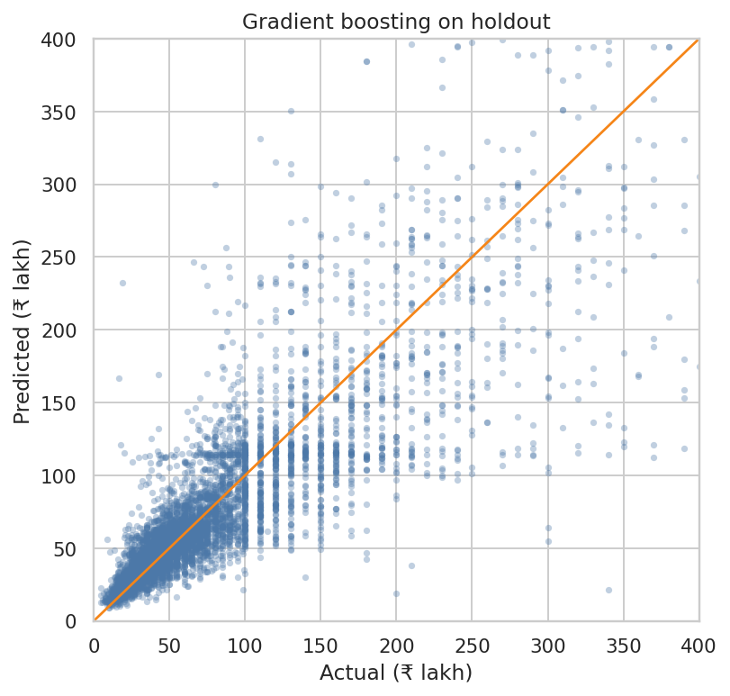
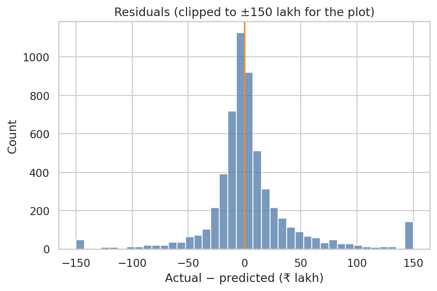
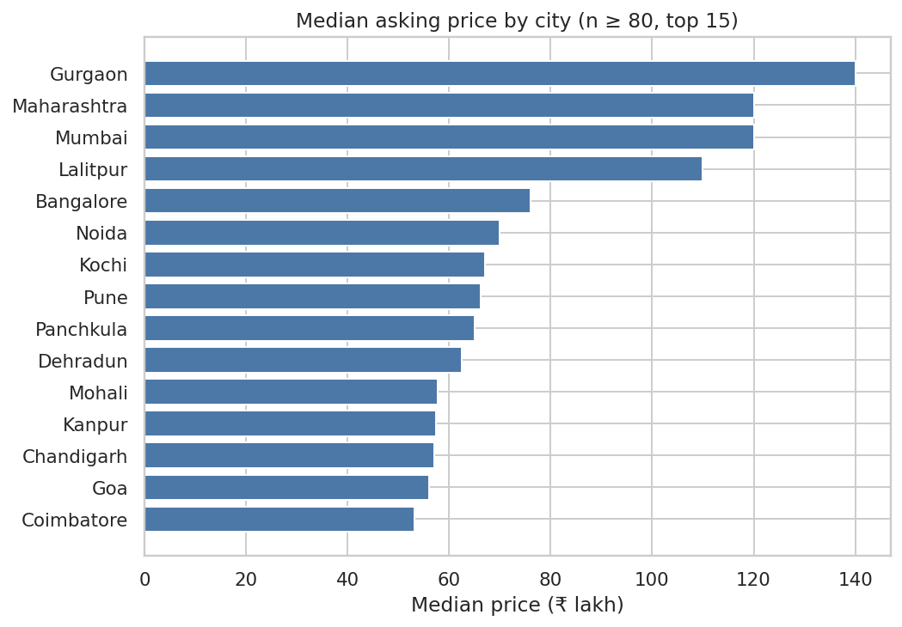

<h1>Indian House Price Prediction</h1>

  
  
  
  
  
  

<blockquote><em>Regression on 29K Indian residential listings — gradient boosting with log-target transform, plus a Streamlit form for live price prediction.</em></blockquote>

<h2>The question</h2>

Can you guess the asking price of a listing from size, city, BHK, and a few flags?

This is a regression project on Indian residential listings. The public file is the training split of <a href="https://www.kaggle.com/datasets/anmolkumar/house-price-prediction-challenge">House Price Prediction Challenge</a> (Anmol Kumar / MachineHack, 29,451 rows). There is a Kaggle <code>test.csv</code> (68,720 rows) with <strong>no prices</strong>, so I score a holdout from train instead of a Kaggle submission.

<em>Originally built as my MTech final-year project (Oct 2020 – Dec 2021); since rewritten with cleaner features and a single gradient-boosting model.</em>

The walkthrough is <a href="notebooks/house_price_prediction.ipynb"><code>notebooks/house_price_prediction.ipynb</code></a>. A small Streamlit form is <a href="app.py"><code>app.py</code></a> — same features, no ₹/sqft.

<h2>The number I care about</h2>

On a 20% holdout (5,743 listings), <strong>gradient boosting</strong> is off by <strong>₹12.1 lakh</strong> on a typical home (median absolute error) and <strong>₹28.5 lakh</strong> on average. R² is <strong>0.71</strong>.

A median-price dummy is already off by ₹28.6 lakh typically / ₹57.6 lakh on average. Size and city do most of the work.

I also trained ridge regression (MAE ₹30.8 lakh, R² 0.65) and a random forest (MAE ₹29.3 lakh, R² 0.67). The forest is close. I kept gradient boosting as the main model.

Prices are skewed (median <strong>₹61 lakh</strong>, mean ₹96 lakh after cleaning), so I fit on <code>log1p(price)</code> and convert back to lakh for the metrics above.

<h2>Data</h2>

<table>
  <thead>
    <tr><th></th><th></th></tr>
  </thead>
  <tbody>
    <tr><td>File</td><td><a href="data/train.csv"><code>data/train.csv</code></a></td></tr>
    <tr><td>Raw rows</td><td>29,451</td></tr>
    <tr><td>After dropping 401 duplicates and 339 junk rows</td><td><strong>28,711</strong></td></tr>
    <tr><td>Target</td><td><code>target(price_in_lacs)</code> — asking price in ₹ lakh</td></tr>
    <tr><td>Median listing</td><td>₹61 lakh · 1,169 sq ft · 2 BHK</td></tr>
  </tbody>
</table>

Junk rows: area under 200 or over 8,000 sq ft, price under ₹5 lakh or over ₹1,500 lakh, or more than 8 BHK. A few listings are 80 million sq ft or ₹300 crore. Those are not apartments.

I do <strong>not</strong> put ₹/sqft in the model. That number is just <code>price × 1e5 / square_ft</code>. Feeding it in is the same as handing the model the answer. I only use it in the EDA plots.

<code>ready_to_move</code> is the exact flip of <code>under_construction</code> (29,451 / 29,451). I keep one of them.

The CSV columns called <code>longitude</code> and <code>latitude</code> look swapped (Bangalore sits at 12.97, 77.60 in those two columns). 255 cleaned rows also fall outside India. I did not use the coordinates as features.

<h2>Split</h2>

Random 80/20, <code>random_state=42</code>.

<ul>
  <li><strong>Train:</strong> 22,968 listings</li>
  <li><strong>Test:</strong> 5,743 listings</li>
</ul>

<h2>Results (holdout, price in ₹ lakh)</h2>

<table>
  <thead>
    <tr>
      <th>Model</th>
      <th>MAE</th>
      <th>Median AE</th>
      <th>RMSE</th>
      <th>R²</th>
      <th>MAPE</th>
    </tr>
  </thead>
  <tbody>
    <tr>
      <td>Median price</td>
      <td>57.6</td>
      <td>28.6</td>
      <td>124.2</td>
      <td>—</td>
      <td>67.7%</td>
    </tr>
    <tr>
      <td>Ridge</td>
      <td>30.8</td>
      <td>13.6</td>
      <td>70.4</td>
      <td>0.65</td>
      <td>31.6%</td>
    </tr>
    <tr>
      <td>Random forest</td>
      <td>29.3</td>
      <td>11.7</td>
      <td>68.1</td>
      <td>0.67</td>
      <td>29.7%</td>
    </tr>
    <tr>
      <td><strong>Gradient boosting</strong></td>
      <td><strong>28.5</strong></td>
      <td><strong>12.1</strong></td>
      <td><strong>64.4</strong></td>
      <td><strong>0.71</strong></td>
      <td><strong>28.7%</strong></td>
    </tr>
  </tbody>
</table>

Mean error is larger than median error because Mumbai / Gurgaon listings in the tail are expensive. Off by ₹12 lakh on a ₹61 lakh home is the typical case.

<h2>What showed up in the data</h2>

<ul>
  <li>Bigger homes cost more, with a lot of scatter. log(area) vs log(price) correlation is <strong>0.59</strong>.</li>
  <li>1 BHK median <strong>₹33 lakh</strong>, 2 BHK <strong>₹49 lakh</strong>, 3 BHK <strong>₹80 lakh</strong>, 4 BHK <strong>₹190 lakh</strong>.</li>
  <li>Gurgaon <strong>₹140 lakh</strong>, Mumbai <strong>₹120 lakh</strong>, Bangalore <strong>₹76 lakh</strong>, Jaipur <strong>₹36 lakh</strong>, Bhopal <strong>₹26 lakh</strong>.</li>
  <li>Dealer listings median <strong>₹79 lakh</strong>, owner <strong>₹45 lakh</strong>, builder <strong>₹41 lakh</strong>. Mix of product and who posts what.</li>
  <li>RERA-tagged listings median <strong>₹73 lakh</strong> vs <strong>₹56 lakh</strong> without.</li>
</ul>

Two location quirks I left in the table but would not take literally:

<ul>
  <li><strong>Lalitpur</strong> (2,900 cleaned rows) is mostly Thane / Mulund / Chembur / Kharghar written as <code>…,Lalitpur</code>. Same story for <strong>Maharashtra</strong> (1,531 rows). Median ₹/sqft there is ~₹12–13k, like Mumbai, not UP.</li>
  <li>I still use those city labels. The model can treat them as a Mumbai-ish group. I would not put "Lalitpur, Uttar Pradesh" on a map of Chembur.</li>
</ul>

<h2>Tech stack</h2>

<table>
  <thead>
    <tr><th>Layer</th><th>Tools</th></tr>
  </thead>
  <tbody>
    <tr><td>Language</td><td>Python 3</td></tr>
    <tr><td>Data</td><td>pandas, NumPy</td></tr>
    <tr><td>Modeling</td><td>scikit-learn (Ridge, RandomForestRegressor, GradientBoostingRegressor)</td></tr>
    <tr><td>Target transform</td><td><code>log1p(price)</code> — back-converted for reporting</td></tr>
    <tr><td>Visualization</td><td>matplotlib, seaborn</td></tr>
    <tr><td>App framework</td><td>Streamlit</td></tr>
    <tr><td>Notebook</td><td>Jupyter</td></tr>
    <tr><td>Persistence</td><td>joblib</td></tr>
  </tbody>
</table>

<h2>How to run</h2>

<pre><code>python -m pip install -r requirements.txt
jupyter notebook notebooks/house_price_prediction.ipynb</code></pre>

The notebook looks for <code>data/train.csv</code> from the repo root. It writes figures to <code>reports/figures/</code> and the model to <code>models/gradient_boosting.joblib</code>.

To open the Streamlit form (needs that joblib file):

<pre><code>streamlit run app.py</code></pre>

The form exposes the same features the model was trained on — city, BHK count, square footage, posted-by type, RERA / resale / ready-to-move flags — and returns a predicted asking price in ₹ lakh. It deliberately does <strong>not</strong> ask for ₹/sqft, because that would be handing the answer to the model.

<h2>Layout</h2>

<pre><code>app.py                                 Streamlit form (same features as the notebook)
data/train.csv                         original Kaggle train split
data/README.md                         dataset source
notebooks/house_price_prediction.ipynb cleaning, EDA, models
models/gradient_boosting.joblib        written by the notebook, read by app.py
reports/figures/
requirements.txt
LICENSE                                MIT</code></pre>

<table>
  <thead>
    <tr><th>File you started with</th><th>Where it lives now</th></tr>
  </thead>
  <tbody>
    <tr><td><code>train.csv</code></td><td><code>data/train.csv</code></td></tr>
    <tr><td><code>city_ppsqft.ipynb</code></td><td>rewritten as <code>notebooks/house_price_prediction.ipynb</code></td></tr>
    <tr><td><code>ml_app_cop.py</code></td><td>rewritten as <code>app.py</code> (sklearn model, area in sq ft, not ₹/sqft)</td></tr>
    <tr><td><code>README.md</code></td><td>this file</td></tr>
  </tbody>
</table>

<h2>Limits</h2>

<ul>
  <li>Listings, not closed sales. Asking price can be optimistic.</li>
  <li>No year, floor, building age, or amenities. City + size is a blunt instrument.</li>
  <li>Lalitpur / Maharashtra labels are messy. Coordinates are messy too.</li>
  <li>I did not use the Kaggle test file. It has no prices, so I cannot score it.</li>
  <li>MAE on cheap cities looks worse in rupees on Mumbai. Percentage error (MAPE ~29%) is the fairer comparison across cities.</li>
</ul>

<h2>License</h2>

Code is MIT. Data is from the Kaggle / MachineHack extract — see <a href="data/README.md"><code>data/README.md</code></a>.

